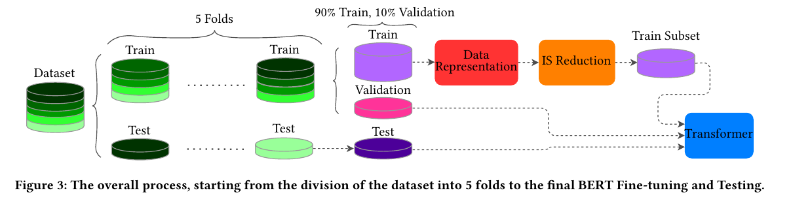

# qclef-instance-selection

Repository of Quantum Clef 2025 Task 2 (Instance Selection)

# Installation: 
1) clone the repository
2) navigate to the directory and run pip install -e .

# Train/Test/Validation Split
Please refer to Figure 3 from the Pasin 2024 paper.

# Project structure:

# Relevant prior repositories:
* Repo of the main background paper of this task: https://github.com/MjPaxter/2024-ICTIR-ISQA
.
 